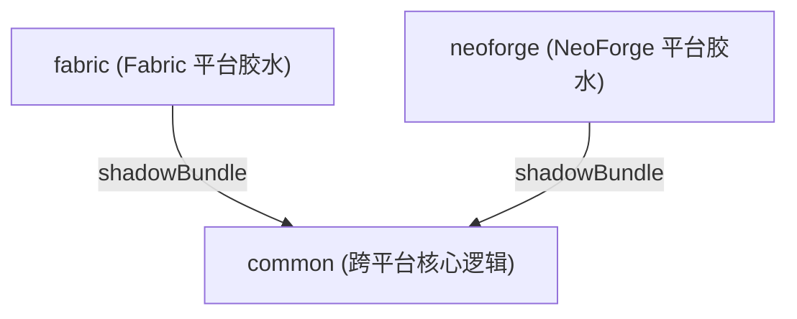
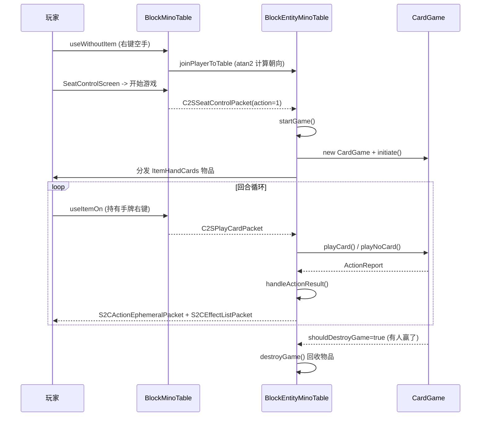

# Minopp 项目架构文档

> 本文档供 AI Agent 上下文初始化使用。所有描述均基于实际代码，引用具体文件路径和符号名。

## 1. 项目总览

Minopp 是一个 Minecraft Mod，在游戏内实现了 UNO 纸牌游戏。玩家可以在一张 2x2 多方块桌子上入座、发牌、出牌，支持 AI 机器人对手。

- **Mod ID**: `minopp`
- **版本**: 1.4.0
- **目标 MC**: 1.21.1
- **Java**: 21
- **构建系统**: Gradle + Architectury Loom 1.7 + Shadow
- **Mappings**: Mojang 官方 + Parchment 1.21 (2024.07.28)
- **活跃平台**: Fabric, NeoForge（`forge` 模块已废弃，未在 `settings.gradle` 中启用）

### 依赖

| 依赖 | 用途 |
|------|------|
| Fabric API 0.102.1+1.21.1 | Fabric 平台基础 |
| NeoForge 21.1.35 | NeoForge 平台基础 |
| YACL 3.6.1+1.21 | AI 机器人配置界面（Fabric 硬依赖，NeoForge 可选） |
| Touhou Little Maid 1.21-1.1.14 | NeoForge 兼容集成（女仆 AI 打牌） |
| SignMeUp NeoForge 1.21.1 | NeoForge 兼容集成（小地图可见性） |

## 2. 模块结构

```
settings.gradle: include 'common', 'fabric', 'neoforge'
```



- **common**: 全部游戏逻辑、渲染、GUI、网络协议定义、平台抽象接口
- **fabric**: Fabric 入口点、事件注册、`@ExpectPlatform` 实现、Fabric mixin
- **neoforge**: NeoForge 入口点、事件注册、`@ExpectPlatform` 实现、NeoForge mixin、兼容模块

## 3. 包结构与类职责

所有 common 源码位于 `common/src/main/java/cn/zbx1425/minopp/`。

### 3.1 game — 核心游戏逻辑

| 类 | 职责 |
|---|---|
| `Card` | UNO 卡牌值对象。含 `Suit`(RED/YELLOW/GREEN/BLUE/WILD)、`Family`(NUMBER/SKIP/REVERSE/DRAW) 枚举。`equivCard` 字段实现万能牌颜色选择的覆盖机制。`createDeck()` 生成标准 108 张牌组。`canPlayOn()` 判断出牌合法性。 |
| `CardGame` | 游戏引擎/状态机。持有玩家列表、牌堆、弃牌堆、回合指针、累计罚抽数。`PlayerActionPhase` 枚举定义两阶段回合：`DISCARD_HAND`(出牌或摸牌) -> `DISCARD_DRAWN`(打出摸到的牌或过)。关键方法：`playCard()`、`playNoCard()`、`shoutMino()`、`doubtMino()`、`advanceTurn()`。支持"切牌"(cut)——持有相同牌可抢先出牌。 |
| `CardPlayer` | 玩家数据持有者。按 UUID 标识，持有手牌 `hand: List<Card>` 和 `shoutedMino` 标志。 |
| `ActionMessage` | `record` 类型，配对消息类型 (`STATE`/`FAIL`/`MESSAGE_ALL`) 与 `Component` 文本。 |
| `ActionReport` | 游戏操作结果的流式构建器兼返回值。聚合状态消息、临时消息、音效/视觉效果、游戏销毁标志。 |
| `AutoPlayer` | AI 玩家决策逻辑。出牌优先级：同数字换色 > 非罚抽万能牌 > 同花色 > 任意可出 > 摸牌。可配置友好模式(不赢/不对人类罚抽/概率忘喊Mino)。 |

### 3.2 block — 方块与方块实体

| 类 | 职责 |
|---|---|
| `BlockMinoTable` | 2x2 多方块桌子。`TablePartType` 枚举定义四个部分，仅 `X_LESS_Z_LESS` 创建 BlockEntity。处理放置/破坏/交互。内部类 `Client` 封装客户端射线检测和按键查询。 |
| `BlockEntityMinoTable` | 游戏状态容器。持有 `CardGame`、四方向座位 `Map<Direction, CardPlayer>`、奖品 `award`、演示模式 `demo`。`startGame()` 分发手牌物品，`destroyGame()` 回收物品，`handleActionResult()` 是所有游戏操作结果的中央分发器。 |

### 3.3 entity — 实体

| 类 | 职责 |
|---|---|
| `EntityAutoPlayer` | AI 机器人实体（`LivingEntity` 子类）。自动寻找附近空桌入座，模拟思考延迟后调用 `AutoPlayer` 出牌。支持自定义皮肤（异步 `GameProfile` 查询）和 YACL 配置界面。 |

### 3.4 item — 物品

| 类 | 职责 |
|---|---|
| `ItemHandCards` | 玩家手持的"手牌"物品，通过 `DataComponent` 绑定到具体牌桌。内部 record `CardGameBindingComponent(BlockPos, UUID)` 关联桌子位置和持有者 UUID。`DATA_COMPONENT_TYPE_CLIENT_HAND_INDEX` 存储客户端选中的手牌索引。 |
| `ItemCoupon` | 简单奖品物品，仅有 tooltip 描述。 |

### 3.5 network — 网络协议

| 包 | 方向 | 用途 |
|---|---|---|
| `C2SPlayCardPacket` | C->S | 多态包：出牌(action=0)、摸牌/过(action=1)、质疑Mino(action=2) |
| `C2SSeatControlPacket` | C->S | 游戏生命周期：开始(1)、停止(0)、重置座位(-1) |
| `C2SAutoPlayerConfigPacket` | C->S | 配置/删除 AI 机器人（需 op 权限） |
| `S2CActionEphemeralPacket` | S->C | 推送临时操作消息到客户端 HUD |
| `S2CAutoPlayerScreenPacket` | S->C | 通知客户端打开 AI 配置界面（运行时检测 YACL 可用性） |
| `S2CEffectListPacket` | S->C | 批量发送效果事件（音效/视觉），使用每类型独立的 `StreamCodec` |

### 3.6 effect — 效果系统

| 类 | 职责 |
|---|---|
| `EffectEvent` | 接口，定义效果事件的类型系统和双端执行路径 (`summonClient`/`summonServer`) |
| `EffectEvents` | 静态注册表，5 种效果类型，`EFFECT_RADIUS = 16` |
| `EffectQueue` | 客户端优先队列，按 `timeOffset` 调度效果播放，`synchronized` 保护 |
| `SoundEffectEvent` | 播放定位音效，重置死人开关计时器 |
| `PlayerFireworkEffectEvent` | 在目标玩家头顶生成烟花（含 `WIN_EXPLOSION` 预设） |
| `PlayerGlowEffectEvent` | 服务端给目标添加发光效果 |
| `GrantRewardEffectEvent` | 服务端给赢家发放奖品物品 |
| `SeatActionTakenEffectEvent` | 客户端关闭座位控制界面 |

### 3.7 render — 渲染

| 类 | 职责 |
|---|---|
| `BlockEntityMinoTableRenderer` | 渲染桌面上的抽牌堆（堆叠卡背模型）和弃牌堆（sprite atlas 顶点绘制）。顶牌显示浮动文字标签。光标命中抽牌堆时绘制黄色 AABB 高亮。 |
| `EntityAutoPlayerRenderer` | 使用标准玩家模型渲染 AI 机器人，根据皮肤元数据切换 slim/wide 模型。 |
| `HandCardsWithoutLevelRenderer` | `BlockEntityWithoutLevelRenderer` 子类，按 `ItemDisplayContext` 分支渲染：第一人称不渲染（由 HUD 显示）、第三人称堆叠卡背 + 回合箭头动画、GUI 单张倾斜卡背。 |

### 3.8 gui — 界面

| 类 | 职责 |
|---|---|
| `GameOverlayLayer` | 主 HUD 叠加层。渲染手牌扇形排列（sprite atlas）、游戏状态文本、光标提示、FOV 缩放动画、死人闹钟警告。 |
| `SeatControlScreen` | 游戏前座位管理界面：显示 N/S/E/W 座位和开始/停止/重置按钮。 |
| `WildSelectionScreen` | 万能牌颜色选择弹窗：4 色按钮 + 取消。 |
| `AutoPlayerScreen` | YACL3 构建的 AI 机器人配置界面。 |
| `TurnDeadMan` | 死人开关——玩家回合闲置 8 秒后播放循环警报音。`pedal()` 重置计时器。 |

### 3.9 platform — 平台抽象

| 类 | 职责 |
|---|---|
| `ClientPlatform` | `@ExpectPlatform` 客户端静态方法桩 |
| `ServerPlatform` | `@ExpectPlatform` 服务端静态方法桩（网络收发、事件注册、BlockEntity 工厂） |
| `RegistriesWrapper` | 跨平台注册接口（方块、物品、实体类型、音效、DataComponent） |
| `RegistryObject<T>` | 懒加载单例包装器，首次 `get()` 时创建并缓存 |
| `GroupedItem` | 携带 `CreativeModeTab` 引用的 `Item` 子类 |
| `DummyLookupProvider` | 空操作的 `HolderLookup.Provider` 单例，用于不需要注册表的 NBT 序列化场景 |

### 3.10 mixin

| Mixin | 目标 | 用途 |
|---|---|---|
| `InventoryMixin` (common) | `Inventory.swapPaint` | 持有手牌时劫持鼠标滚轮，改为切换手牌索引 |
| `KeyMappingAccessor` (common) | `KeyMapping` | 访问器，暴露 `key` 字段供读取按键绑定 |
| `AbstractClientPlayerMixin` (Fabric) | `AbstractClientPlayer` | 将 `MinoClient.globalFovModifier` 乘入 FOV 修正值 |
| `BlockEntityMinoTableRendererMixin` (NeoForge) | `BlockEntityMinoTableRenderer` | 返回 `AABB.INFINITE` 渲染包围盒，防止牌桌渲染被裁剪 |

### 3.11 入口点

| 平台 | 服务端入口 | 客户端入口 |
|---|---|---|
| common | `Mino` (注册表 + 钩子) | `MinoClient` (按键绑定 + 音效队列) |
| Fabric | `MinoFabric` | `MinoFabricClient` |
| NeoForge | `MinoNeoForge` | `ClientProxy` |

### 3.12 兼容集成 (仅 NeoForge)

| 模块 | 位置 | 功能 |
|---|---|---|
| Touhou Little Maid | `neoforge/.../compat/touhou_little_maid/` (6 类) | 女仆 AI 寻找牌桌并自动打牌，注册 POI 类型和记忆模块 |
| SignMeUp | `neoforge/.../compat/signmeup/MinimapVisibility.java` | 小地图元素可见性控制 |

## 4. 核心数据流

### 4.1 游戏生命周期



### 4.2 网络协议路由

所有包通过 `CompatPacketRegistry` 注册。`CompatPacket` 将 `FriendlyByteBuf` 包装为平台原生的 `CustomPacketPayload`，使用 `retainedDuplicate()` 技巧绕过平台的 codec 系统，保持自定义序列化。

### 4.3 效果管道

服务端 `ActionReport` 中的效果 -> `handleActionResult()` 分为两步：
1. 服务端效果（`PlayerGlowEffectEvent`, `GrantRewardEffectEvent`）立即在服务端执行
2. 所有效果序列化为 `S2CEffectListPacket` 发送给范围内客户端
3. 客户端 `EffectQueue` 按 `timeOffset` 排队，在 `MinoClient` tick 中消费播放

## 5. 资源与资产

- **Sprite Atlas**: `textures/gui/deck.png` (256x128)，包含所有 UNO 卡面。UV 由 `Card.family` 和 `Card.suit.ordinal()` 计算。
- **音效**: `draw_multi.ogg` (摸多张牌), `mino_shout.ogg` (喊 Mino)
- **本地化**: zh_cn, zh_tw, zh_hk, en_us, ja_jp, de_de
- **方块模型**: `mino_table.json` (2x2 桌子)
- **物品模型**: `hand_cards.json` + `hand_cards_model_placeholder.json` (BEWLR 占位), `coupon.json`, `mino_table.json`

## 6. 关键设计决策

1. **Mino 喊叫通过聊天拦截实现**：`Mino.onServerChatMessage` 拦截匹配 "mino"/"uno"/"minopp" 的聊天消息（忽略大小写和空格/感叹号），触发 `shoutMino()` 并抑制原始消息。`/minopp shout` 命令作为备用方式。

2. **质疑通过攻击实体实现**：`Mino.onPlayerAttackEntity` 在持有手牌时攻击其他实体触发 `doubtMino` 协议。

3. **`equivCard` 覆盖机制**：万能牌选色后不修改原始卡牌，而是附加一个 `equivCard` 字段。`canPlayOn()` 递归解包双方的 `equivCard` 进行匹配。罚抽被接受后，顶牌的 `equivCard` 的 family 被覆盖为 `NUMBER`，阻止下一位玩家继续叠加。

4. **全量 BlockEntity 同步**：`getUpdateTag` 发送完整状态而非增量，简化了同步逻辑但增加了网络开销。

5. **客户端/服务端分离**：通过内部类 `Client`（如 `BlockMinoTable.Client`, `EntityAutoPlayer.Client`）隔离仅客户端代码，避免服务端类加载问题。
